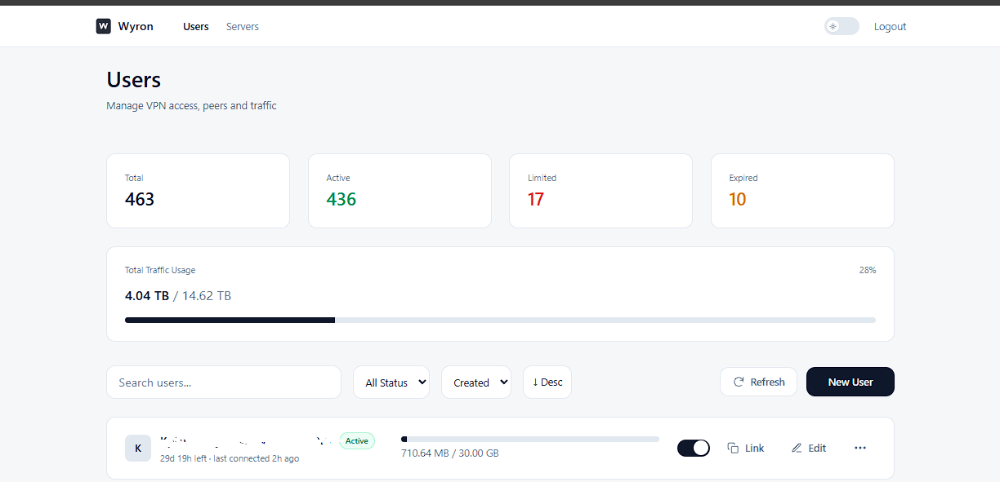
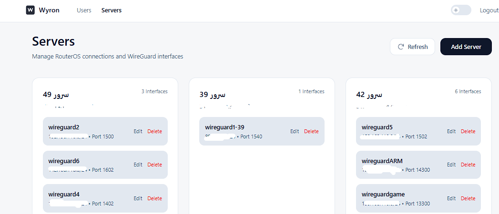
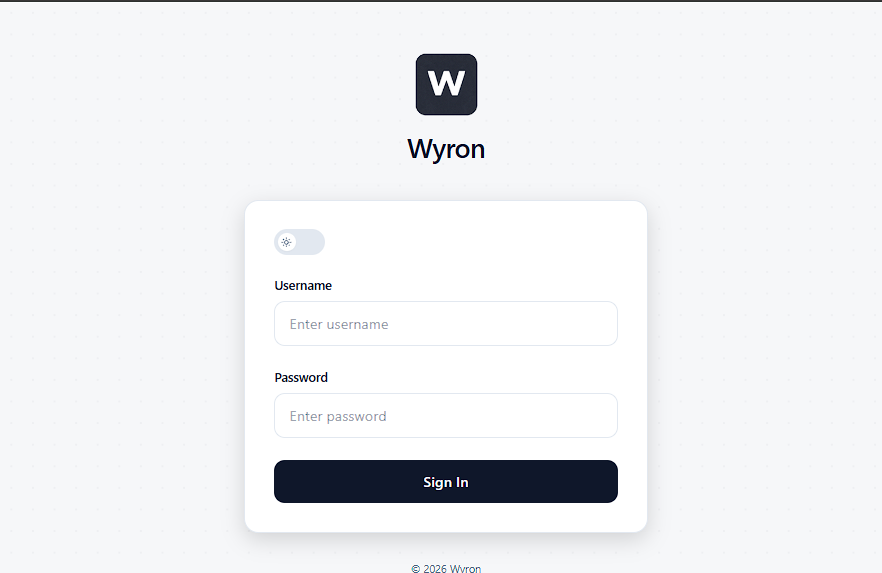

# 🚀 Wyron
### High-Performance WireGuard Management Panel (Go Powered)

[]
[]
[]

---

## 🖼 پیش‌نمایش پنل

  
  

  
  

---

## ✨ معرفی

 یک پنل مدیریت حرفه‌ای WireGuard است که با زبان **Go** توسعه داده شده و با تمرکز بر:

- ⚡ حداکثر Performance
- 🔐 امنیت بالا
- 🌍 مدیریت چند سرور و لوکیشن
- 📡 API قدرتمند

ساخته شده است.

---

## 🔥 ویژگی‌ها

### ⚡ High Performance Core
- نوشته شده با **Golang**
- مصرف رم پایین
- سرعت بالا در مدیریت یوزر و کانفیگ
- سیستم کش و دیتابیس هوشمند و مدرن (Mongo DB)
---

### 🌍 Multi Location Support
- هر کاربر می‌تواند چندین لوکیشن WireGuard داشته باشد
- تولید لینک سابسکریپشن تحت وب برای کانفیگ‌ها

---

### 🖥 Multi Server & MikroTik Support
- مدیریت همزمان چندین سرور
- پشتیبانی از چندین Interface
- پشتیبانی کامل از MikroTik
- استفاده از Api Native میکروتیک

---

### 🧩 Web Panel
- پنل وب کامل و مدرن
- مدیریت کاربران، سرورها و اینترفیس ها
- داشبورد تمیز و حرفه‌ای

---

### 💻 CLI Interface
- ابزار CLI کامل برای مدیریت سریع
- مناسب DevOps و Automation

---

### 🔗 Powerful APIs
- REST API
- gRPC API
- مناسب اتصال به پنل‌های دیگر یا اتوماسیون

---

### 📡 Subscription Link
- لینک سابسکریپشن اختصاصی برای هر کاربر
- دریافت و بروزرسانی خودکار کانفیگ‌ها

---

### 🛠 Responsive Support
- پشتیبانی پاسخگو
- آپدیت‌های منظم

## 💳 خرید و دریافت نسخه کامل

نسخه کامل Wyron به صورت تجاری ارائه می‌شود.

برای دریافت دمو، قیمت و خرید لایسنس:

📩 تلگرام:  
👉 https://t.me/wyronapp

---
